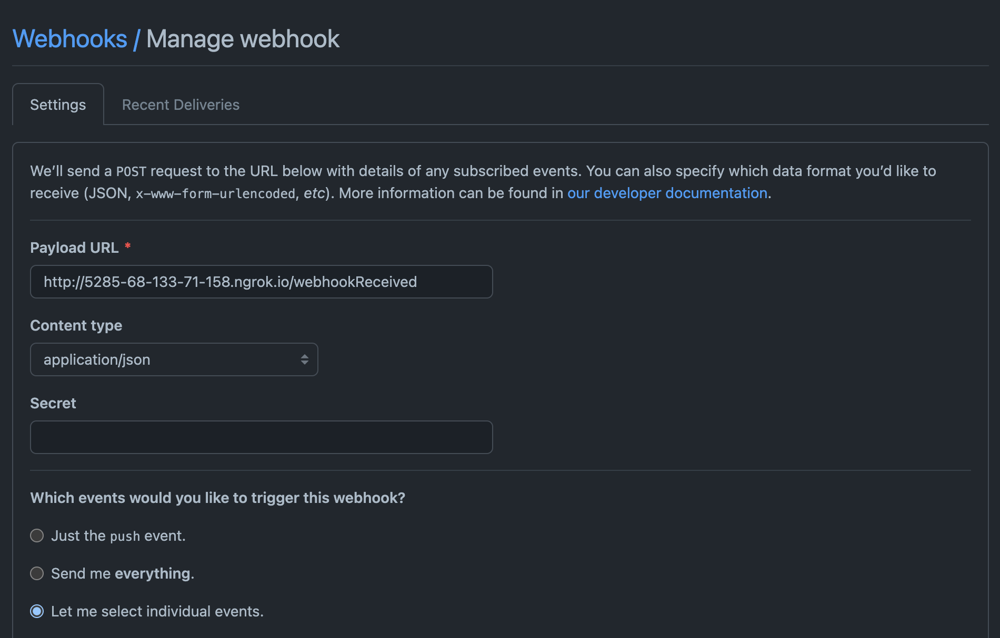

# Auto Create Branch Protection Rules and Issues with GitHub API

This python web service listens to organization events to identify when a new repository is created (or imported), and then proceeds to do the following:

1. Check if the new repository has been initialized; if not, automatically commit a `Readme.md` to the `main` branch
2. Create branch protection rules on the `default branch`
3. Create an issue in newly created repository, outlining the policies created, and notifying a specific user with an `@mention` in the body of the issue.

## Getting Started

### Software to Install

This application requires the following to be installed:

1. [Python 3](https://www.python.org/downloads/)
2. [Flask](https://flask.palletsprojects.com/en/2.0.x/installation/)
3. [ngrok for Port Forwarding](https://ngrok.com/download)

### Setting Up the Server

Clone the repository and install the necessary dependencies using:

```bash
pip install -r requirements.txt
```

Create a [GitHub Access Token](https://docs.github.com/en/authentication/keeping-your-account-and-data-secure/creating-a-personal-access-token) named `GH_AUTH_TOKEN` with the necessary Full control of Private Repositories. This Token then should be added as a local environment variable:

```bash
export GH_AUTH_TOKEN={GitHub Access Token}
```

In the `main.py` of the newly cloned repository, the following fields should be updated/confirmed based on your needs:

```py
gh_token = os.environ.get("GH_AUTH_TOKEN") # GitHub Access Token Saved to Environment
README_FILE_ADD = 'README.md' # File to Add if New Repo is Empty
ASSIGNED_USER = 'klsember' # Assigned User to be notified in Created Issues
LOG_FILENAME = 'auto-create-branch-rules.log' # Name of log file to append to stored within the repo
```

To start the application, run the below, specifying the `host` and `port`:

```bash
export FLASK_APP=main.py
flask run --host=0.0.0.0 --port=8080
```


Once the application is running locally, start the ngrok forwarding service

```bash
./ngrok http 8080
```

The forwarding service will provide the forwarding address, such as `https://e710-68-133-71-158.ngrok.io`, which will be the Webhook's Payload URL, and the route additional path `/webhookReceived`. 

### Create a Webhook

To [set up a WebHook](https://docs.github.com/en/developers/webhooks-and-events/webhooks/creating-webhooks#setting-up-a-webhook) for the organization, navigate to the Organization Settings and the Webhooks page under **Code, planning, and automation**.

<br>



<br>

The webhook should be configured as follows:

* The Payload URL should be set to the forwarding address and `/webhookReceived` (i.e. `https://e710-68-133-71-158.ngrok.io/webhookReceived`).
* The Content type should be set to `application/json`
* Secret should be left blank
* Under **Which events would you like to trigger this webhook?**, choose **Let me select individual events.**
    * To track when new repositories are created,  only the `Repositories` box is to be checked
    * Ensure the default `Pushes` is unchecked

Once a Webhook is set up, GitHub automatically sends a request to test the connection, which can be viewed under the [Recent Deliveries](https://docs.github.com/en/developers/webhooks-and-events/webhooks/testing-webhooks#listing-recent-deliveries) tab.

Now, create a new repository in the organization to test the functionality of service!

#### Note

After the webhook has been set up, the [webhook can be secured](https://docs.github.com/en/developers/webhooks-and-events/webhooks/securing-your-webhooks) using a Secret Token that can be configured on the webhook and the server where the web service is cloned.

## Resources Used

1. [GitHub Webhooks and Events](https://docs.github.com/en/developers/webhooks-and-events/webhooks/webhook-events-and-payloads)
2. [Intro to Webhooks and Python](https://towardsdatascience.com/intro-to-webhooks-and-how-to-receive-them-with-python-d5f6dd634476)
3. [Ngrok for Exposing URLs](https://ngrok.com/docs#getting-started-expose)
4. [GitHub GraphQL API](https://docs.github.com/en/graphql)
5. [Gatsby's Introduction to GraphiQL](https://www.gatsbyjs.com/docs/how-to/querying-data/running-queries-with-graphiql/)
6. [Logging in Python](https://realpython.com/python-logging/)